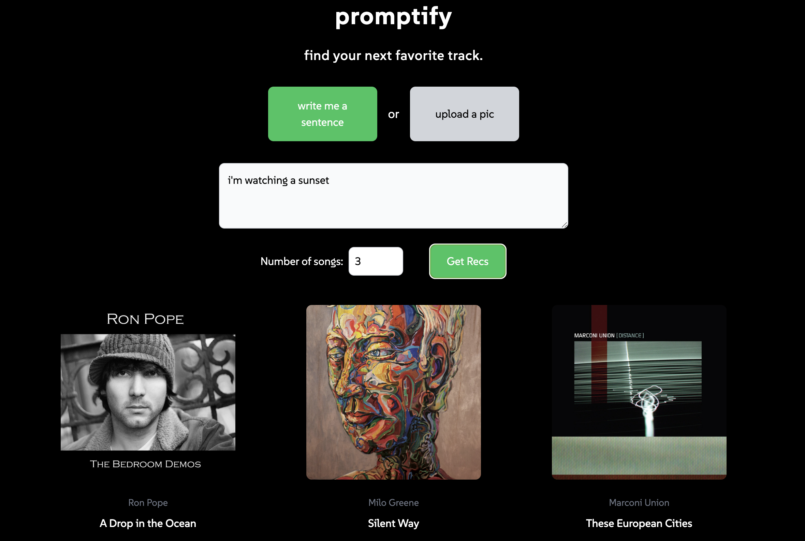

# Promptify - An AI-Driven Music Recommendation App 

Promptify is a web application I created to generate tailored music recommendations based on user input. Simply upload an image or write a sentence about your vibe, what you're doing, or anything you want; the app then uses OpenAI's GPT models to create a cutsomized music experience using Spotify's vast music library.

### Preview



## Features

- **Text Input:** Describe a scene, mood, or activity, and get music recommendations to match.
- **Image Input:** Upload a picture, and the AI analyzes the mood to suggest relevant songs.
- **Number of Recommendations**: Choose the number of songs you want to receive, from 1 to 12, to match your preference.
- **Dynamic Music Suggestions:** Get song details like name, artist, and album cover with direct Spotify links.

#### Tech Stack
- [![Next.js][Next.js]][Next-url]
- [![React][React.js]][React-url]
- [![TailwindCSS][TailwindCSS]][TailwindCSS-url]

#### Libraries/APIs
- [![OpenAI][OpenAI]][OpenAI-url]
- [![Spotify API][SpotifyAPI]][SpotifyAPI-url]
- [![Axios][Axios]][Axios-url]

[Next.js]: https://img.shields.io/badge/Next.js-000000?style=for-the-badge&logo=nextdotjs&logoColor=white
[Next-url]: https://nextjs.org/
[React.js]: https://img.shields.io/badge/React-20232A?style=for-the-badge&logo=react&logoColor=61DAFB
[React-url]: https://reactjs.org/
[TailwindCSS]: https://img.shields.io/badge/Tailwind_CSS-38B2AC?style=for-the-badge&logo=tailwind-css&logoColor=white
[TailwindCSS-url]: https://tailwindcss.com/
[OpenAI]: https://img.shields.io/badge/OpenAI-412991?style=for-the-badge&logo=openai&logoColor=white
[OpenAI-url]: https://openai.com/
[SpotifyAPI]: https://img.shields.io/badge/Spotify_API-1DB954?style=for-the-badge&logo=spotify&logoColor=white
[SpotifyAPI-url]: https://developer.spotify.com/
[Axios]: https://img.shields.io/badge/Axios-5A29E4?style=for-the-badge&logo=axios&logoColor=white
[Axios-url]: https://axios-http.com/
  
## Installation

1. Clone the repository:
   ```bash
   git clone https://github.com/yourusername/promptify.git
   cd promptify

2. Install Dependencies
   ```bash
    npm install

3. Create a `.env/` file and add your OpenAI and Spotify API credentials:
    ```env
    OPENAI_API_KEY=your_openai_api_key
    SPOTIFY_CLIENT_ID=your_spotify_client_id
    SPOTIFY_CLIENT_SECRET=your_spotify_client_secret

4. Run the development server
    ```bash
    npm run dev

5. Open your browser and navigate to `http://localhost:3000`.

## Usage
1. Choose Input Type: Click on "Write me a sentence" for text input or "Upload a pic" for image input then input what you chose.
3. Get Recommendations: Choose how many songs you want to see then click "Get Recs" to fetch songs based on your input.

## License
Distributed under the MIT License. See `LICENSE.txt` for more information.

## Contact Me
Rishi Kumra: rkumra@ucla.edu

## Acknowledgements
* [README Template](https://github.com/othneildrew/Best-README-Template)
* [OpenAI API](https://platform.openai.com/docs/introduction)
* [Spotify API](https://developer.spotify.com/documentation/web-api/)
